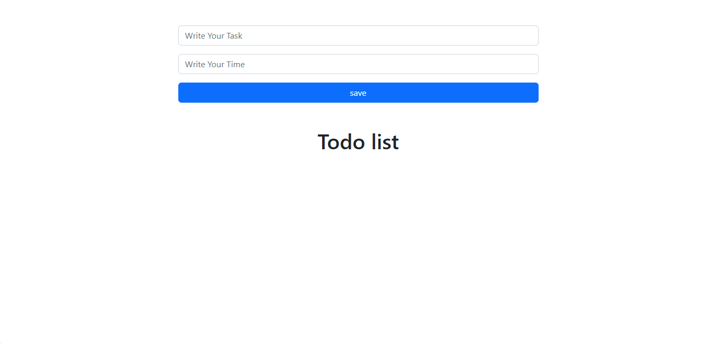

# uncompleted-Todo-List-for-trying-learning

in this simple Todo List application itryied to use [hooks and react-bootstrap] and tryied to send props, at the end i tryed to push it using github+gh-pages but after i changed the name of repo on gethub the live-like failed. It allows users to add and delete todo items. the app is uncompleted because it was uncompleted.

## Table of contents

- [Overview](#overview)
- [Features](#Features)
- [Components](#Components)
  - [App](#App)
  - [form](#form)
- [Installation](#Installation)
- [Usage](#Usage)
- [Links](#Links)
- [Screenshot](#Screenshot)
- [What I learned](#what-i-learned)
- [Continued development](#continued-development)
- [Author](#author)


## overview
in this simple Todo List application itryied to use [hooks and react-bootstrap] and tryied to send props, at the end i tryed to push it using github+gh-pages. It allows users to add and delete todo items. the app is uncompleted because it was uncompleted.


## Features
- Add new todo items
- Delete existing todo items


## Components

### App

The main component that show form component on screen

### form

it contains the whole logic


## Installation
To get started with this project, follow these steps:

you can clone the project or download it as Zip file.
1. Clone the repository:
   ```bash
   git clone https://github.com/olahasan/uncompleted-Todo-List-for-trying-learning.git

2. Navigate to the project directory:
   cd <project-directory>

3. Install the required dependencies:
   npm install   


## Usage
To run the application, use the following command:

npm start


## Links

If you want to open the link in a new tab, you can:

- Press **Ctrl** (or **Cmd** on Mac) while clicking the link.
- Right-click the link and select **Open link in new tab**.

Otherwise, all links will open in the same tab.


- Solution URL: [here](https://github.com/olahasan/uncompleted-Todo-List-for-trying-learning)

- Live Site URL: [here](https://iridescent-narwhal-d91f17.netlify.app/) OR [here](https://btangannnnn-app-v222.netlify.app/)

 ## Screenshot
 



## what-i-learned
Through this project, I learned in this simple project how to create react app,
how to add and delete item and how to deploy it on github+gh-pages

## Continued Development
In the future, I plan to:
- learn more reactJs Hooks.

### Author

GitHub - @olahasan
